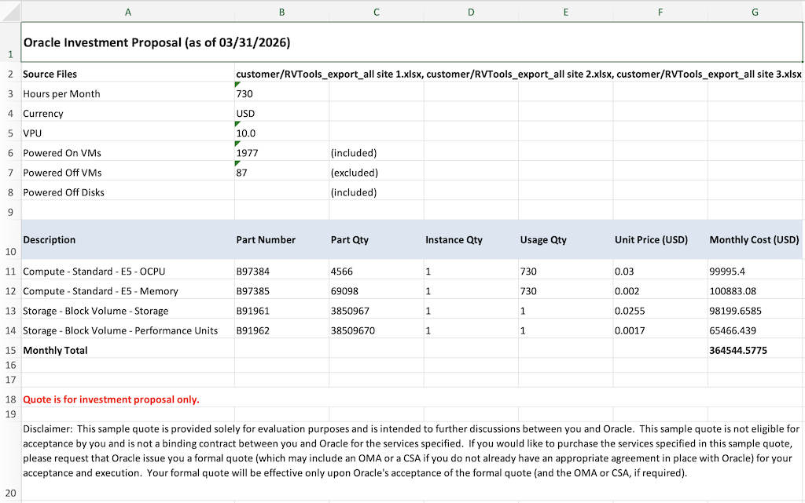
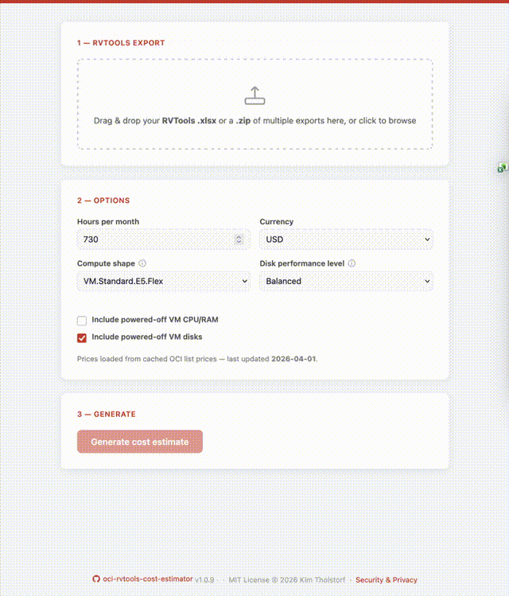

<div align="center">
  
  <h4 align="center">Turn VMware RVTools exports into an Oracle Cloud monthly cost estimate</h4>
</div>

<div align="center">
  <a href="https://rvtools.oci.kim" target="_blank" rel="noopener">
    
  </a>
  <a href="https://pypi.org/project/oci-rvtools/" target="_blank" rel="noopener">
    
  </a>
  <a href="https://github.com/KimTholstorf/oci-rvtools-cost-estimator/tree/main/Formula" target="_blank" rel="noopener">
    
  </a>
</div>

<br>
<!--    
<div align="center">
  <a href="https://rvtools.oci.kim" target="_blank" rel="noopener">
    
  </a>
</div>

<br>
-->

This utility ingests one or more RVTools `vInfo` sheets, pulls the latest Oracle Cloud Infrastructure prices, and generates an Excel file with aggregate monthly costs for all included resources.

Because OCI pricing scales linearly `oci-rvtools` doesn't price individual VMs. Instead it calculates the cost of a hypothetical single VM whose vCPU, RAM, and disk match the combined totals of the ingested workloads. That aggregated cost is identical to summing the per-VM prices, but a lot just easier to calculate and present 🤓.

---

## 🚀 Features

- **Browser-based web app** – no install required. Drop in your RVTools export on [rvtools.oci.kim](https://rvtools.oci.kim) and get the cost estimate instantly. Runs 100% browser-local via WebAssembly — nothing is uploaded, nothing leaves your device. Read [Security & Pricacy](https://rvtools.oci.kim/security.html) for more on this.
- **Direct RVTools ingestion** – reads raw `RVTools_export_all.xlsx` files and ignores housekeeping VMs (`vCLS-*`).
- **Multi-file support** – pass multiple files, a directory, or upload a `.zip` of exports in the web app to aggregate across sites.
- **Configurable inclusion filters** – toggle powered-off VMs for CPU/RAM and powered-off disks for storage calculations independently.
- **Automatic unit handling** – converts MiB totals to GiB, rounds quantities up to whole units, and maps 2 vCPUs to 1 OCPU.
- **Live pricing lookup** – fetches list prices for configurable OCI part numbers via the [OCI pricing API](https://apexapps.oracle.com/pls/apex/cetools/api/v1/products/).
- **Console logging** – prints aggregation totals, pricing inputs, and powered-on/off inclusion choices to the console.
- **Polished Excel output** – writes `oci_cost_summary.xlsx` with two sheets (Total Disk vs. In Use Disk), metadata header, full Excel formulas and advisory text. Designed to look similar to the output from the official [OCI Cost Estimator](https://www.oracle.com/cloud/costestimator.html).

---

## ⚡ Quick start

### Online (no install)

Visit **[rvtools.oci.kim](https://rvtools.oci.kim)** — drop in your RVTools `.xlsx` or a `.zip` of multiple exports, choose your options, and get the cost estimate. Everything runs in your browser via WebAssembly.

### CLI

```bash
# Install from PyPI
pip install oci-rvtools

# Run the estimator
oci-rvtools \
  --rvtools ./customer/RVTools_export_all.xlsx \
  --output oci_cost_summary.xlsx
```

The tool contacts the OCI pricing API at runtime. Ensure the machine has outbound internet access.

---

## 🏗️ Installation options

### PyPI, pipx or uv

```bash
# pip — installs into your active environment
pip install oci-rvtools

# pipx — isolated install, command available system-wide
pipx install oci-rvtools

# uv — one-off run without a permanent install
uvx oci-rvtools --rvtools ./customer/RVTools_export_all.xlsx
```

### Homebrew (macOS)

```bash
brew tap KimTholstorf/oci-rvtools-cost-estimator
brew install oci-rvtools
```

### Docker

```bash
# CLI mode — mount your working directory to /data
docker run --rm \
  -v "$(pwd)":/data \
  ghcr.io/kimtholstorf/oci-rvtools-cost-estimator:latest \
  --rvtools /data/RVTools_export_all.xlsx \
  --output /data/oci_cost_summary.xlsx

# Web app mode — no arguments starts the local web UI on port 8080
docker run --rm -p 8080:8080 \
  ghcr.io/kimtholstorf/oci-rvtools-cost-estimator:latest
# then open http://localhost:8080
```

### From source

```bash
git clone https://github.com/KimTholstorf/oci-rvtools-cost-estimator.git
cd oci-rvtools-cost-estimator
python3 -m venv .venv
source .venv/bin/activate
pip install .

# Run the CLI
oci-rvtools --rvtools ./customer/RVTools_export_all.xlsx

# Or serve the web UI locally
python3 -m http.server 8080 --directory docs/
# then open http://localhost:8080
```

---

## 📥 Input expectations

- RVTools workbook(s) in `.xlsx` format containing the `vInfo` sheet (default `RVTools_export_all.xlsx`).
- All calculations default to powered-on VMs, but powered-off VM CPU/RAM and disk capacity can be included via flags.

---

## 📤 Output workbook

The generated Excel file (`oci_cost_summary.xlsx` by default) contains:

1. **total_disk** – Monthly costs using the total provisioned disk capacity (TiB → GiB).
2. **used_disk** – Monthly costs using the reported "In Use" disk capacity.

Each sheet includes:

- Banner row stamped with the run date.
- Metadata block (source files, hours per month, currency, VPU value, powered-on/off inclusion flags).
- Pricing table with formulas for Part Qty, Instance Qty, Usage Qty, Unit Price, and Monthly Cost.
- Advisory text and disclaimer merged across all columns.

All quantities are rounded up to whole units before pricing. Block Volume Performance Units (VPU) scale with disk capacity (`VPU per GB` × GB).

[](images/oci_cost_summary_example.png)

---

## 🛠️ CLI reference

| Argument | Description |
| --- | --- |
| `--version` | Print the script version and exit. |
| `--rvtools PATH [PATH ...]` | One or more RVTools `.xlsx` files or directories to scan. Required. |
| `--output FILE` | Destination workbook path. Defaults to `oci_cost_summary.xlsx`. |
| `--hours HOURS` | Hours per month to bill. Defaults to `730`. |
| `--currency CODE` | Pricing currency (passed to OCI pricing API). Defaults to `USD`. |
| `--ocpu-part PART` | OCI part number for OCPU per hour (default `B97384`, i.e. **VM.Standard.E5.Flex**). |
| `--memory-part PART` | OCI part number for memory GB per hour (default `B97385`, i.e. **VM.Standard.E5.Flex**). |
| `--storage-part PART` | OCI part number for block storage capacity per month (default `B91961`). |
| `--vpu-part PART` | OCI part number for block volume performance units (default `B91962`). |
| `--vpu VALUE` | VPUs per GB (range 1–120, default `10`, i.e **Balanced** performance level). |
| `--include-poweredoff-vms` | Include powered-off VMs when summing vCPU and RAM. |
| `--include-poweredoff-disks` | Include powered-off VMs when summing disk usage (default). |
| `--exclude-poweredoff-disks` | Ignore powered-off VMs when summing disk usage. |

Paths can point to folders; the script recursively picks up `.xlsx` files (skipping `~$` temp files). Duplicate files are de-duplicated.

---

## 📈 Examples

```bash
# Baseline run (powered-on VMs only, powered-off disks included)
oci-rvtools \
  --rvtools ./customer/RVTools_export_all.xlsx

# Aggregate multiple exports and change output name
oci-rvtools \
  --rvtools ./customer/site-a.xlsx ./customer/site-b.xlsx \
  --output reports/oci_cost_summary.xlsx

# Include powered-off VM CPU/RAM and exclude their disks
oci-rvtools \
  --rvtools ./customer/RVTools_export_all.xlsx \
  --include-poweredoff-vms \
  --exclude-poweredoff-disks

# Override pricing part numbers (VM.Standard.E6.Flex) and hours per month
oci-rvtools \
  --rvtools ./customer/RVTools_export_all.xlsx \
  --hours 744 \
  --ocpu-part B111129 \
  --memory-part B111130

# Ultra High Performance for Storage
oci-rvtools \
  --rvtools ./customer/RVTools_export_all.xlsx \
  --vpu 30   # Ultra High Performance is VPU 30-120.
```

---

## 🍿 Demo

### CLI


### Web-UI



---

## ⚠️ Notes

- The CLI relies on real-time pricing data; expect run failures if the Oracle pricing API is unreachable or if your machine is not connected to the internet.
- Pricing logic assumes USD list rates identical across regions. Adjust currency or part numbers as needed.
- Generated workbooks contain formulas and formatting; Excel recalculates automatically when opened.

---

Happy estimating! Contributions and pull requests are welcome.

---

MIT License — © 2026 Kim Tholstorf
